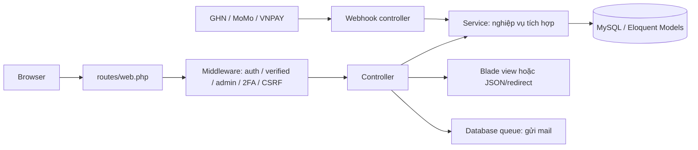
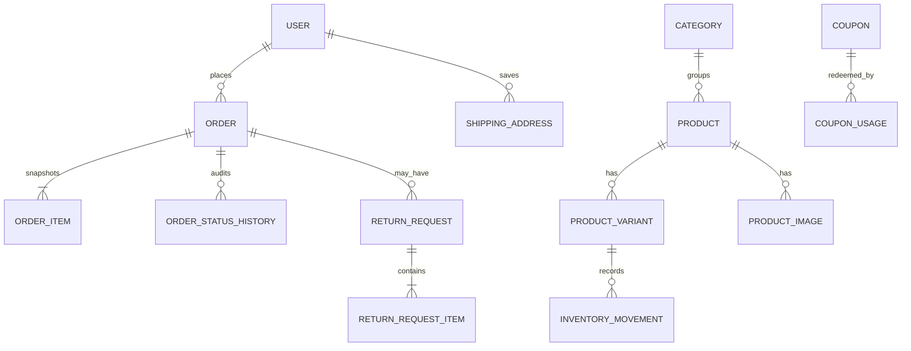
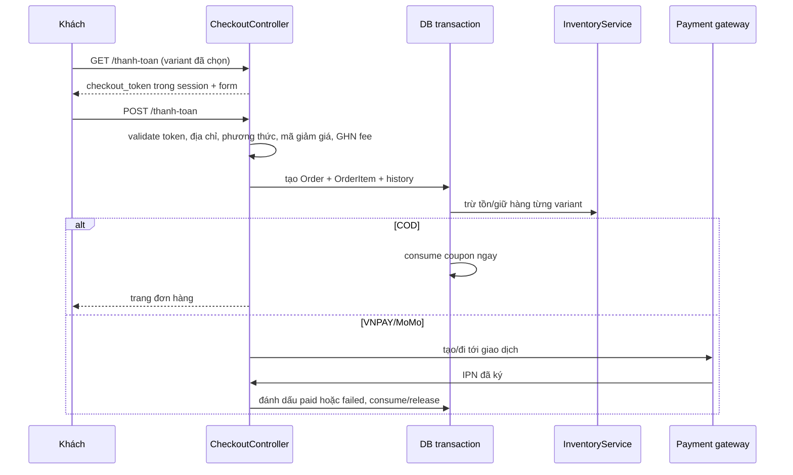

# Học thuộc dự án Vua Beach

Tài liệu này là bản đồ để đọc source theo **luồng nghiệp vụ**, không phải theo
tên thư mục. Mục tiêu: sau khi hoàn thành, bạn có thể tự trả lời: request này đi
qua đâu, dữ liệu đổi ở bảng nào, vì sao phải khóa giao dịch, và nơi sửa đúng khi
thêm tính năng.

## 1. Dự án này là gì?

Vua Beach là website bán đồ bơi Laravel 13, gồm hai vùng:

- **Storefront**: khách xem hàng, giỏ, thanh toán, đơn hàng, yêu thích, đánh giá,
  đổi/trả.
- **Admin**: quản lý catalog, kho, nhập hàng, mã giảm giá, đơn/GHN, đổi trả,
  người dùng, cài đặt và nhật ký.

Các hệ thống ngoài: GHN (vận chuyển), VNPAY/MoMo (thanh toán), SMTP (email),
Sentry (theo dõi lỗi). Giỏ hàng lưu trong `session`, mọi dữ liệu bền vững khác
lưu MySQL qua Eloquent.

## 2. Bản đồ chạy một request



Điểm bắt đầu của HTTP là `public/index.php`, Laravel được dựng ở
`bootstrap/app.php`. File này gắn middleware, loại trừ CSRF cho ba webhook,
đặt alias `admin`/`admin.2fa`, cấu hình Sentry và trang lỗi tiếng Việt.
`routes/web.php` quyết định URL đi tới controller nào.

`AppServiceProvider::boot()` là cấu hình dùng toàn app: rate limit webhook 120
lần/phút/IP; login và đăng ký dùng khóa kép tài khoản/email đã hash + IP;
gửi lại xác thực bị giới hạn 1 lần/phút và 6 lần/giờ; ép HTTPS ngoài localhost,
Bootstrap pagination, nạp cài đặt site cho mọi view và tối đa 6 danh mục cho
thanh điều hướng.

## 3. Thứ tự đọc source hiệu quả

Đọc theo đúng thứ tự dưới đây; mỗi mục chỉ chuyển tiếp khi bạn tự giải thích
được nó mà không nhìn code.

1. `README.md`, `.env.example`, `composer.json`, `package.json` — hiểu cách chạy
   và dependency.
2. `routes/web.php` — lập bảng URL → controller → middleware. Đây là “mục lục”.
3. `bootstrap/app.php`, `app/Providers/AppServiceProvider.php`, ba middleware
   trong `app/Http/Middleware/` — hiểu lớp bảo vệ toàn cục.
4. `database/migrations/` theo thứ tự timestamp, sau đó Models — hiểu schema và
   quan hệ trước khi đọc logic.
5. Storefront: `StorefrontController`, `CartController`, rồi `CheckoutController`.
6. Các service cốt lõi: `InventoryService`, `OrderStateMachine`,
   `CouponRedemptionService`, `WebhookIdempotencyService`.
7. Thanh toán: `VnpayService`/`MomoService`, rồi controller IPN tương ứng.
8. Giao hàng: `GHNService`, `GHNOrderSyncService`, `GhnWebhookController`.
9. Đổi trả: hai `ReturnRequestController` và `ReturnStateMachine`.
10. Admin controllers, mail/notification, console commands, tests và JavaScript.

Mẹo VS Code: đặt con trỏ lên class/method và dùng **F12** (Go to Definition),
**Shift+F12** (Find All References), hoặc `Cmd+P` để mở file. Khi lần một tính
năng, luôn bắt đầu ở route, không bắt đầu ở view.

## 4. Dữ liệu cốt lõi và quan hệ



- `products` là thông tin chung; `product_variants` là màu/size/SKU/tồn kho.
  Chỉ variant `is_active=true` được bán.
- `orders` là đầu đơn. `order_items` **chụp lại** tên, ảnh, giá, màu, size lúc
  mua, nên sau này sửa product không làm sai hóa đơn cũ.
- `inventory_movements` là sổ cái kho; không chỉ đổi `stock` mà luôn ghi biến
  động và `balance_after`.
- `order_status_histories`, `return_request_histories`, `activity_logs` là lịch
  sử/audit. `webhook_receipts` chống xử lý lại callback.
- Schema thật nằm trong migrations, không suy luận chỉ từ Model. Ví dụ migration
  `2026_09_06_000200...` tạo khóa idempotency kho; migration sau đó thêm receipt
  webhook, refund tracking, 2FA.

## 5. Luồng catalog → giỏ hàng

1. `GET /` → `StorefrontController::home`: danh mục ưu tiên + sản phẩm active,
   featured.
2. `GET /san-pham` → `products`: tìm theo `q`, lọc category, sắp giá, paginate.
   Trên mobile, bộ lọc dùng native disclosure và mặc định thu gọn khi chưa có
   điều kiện; desktop luôn mở. `CatalogReadiness` giúp preflight chặn sản phẩm
   test/demo, ảnh ngoài hệ thống, placeholder hoặc đường dẫn ảnh không đọc được.
3. `GET /san-pham/{product:slug}`: route-model binding tìm Product bằng `slug`;
   chỉ hiển thị product active; tải variants, ảnh, review, hàng liên quan.
4. Khách đã mua đơn `completed` mới có `reviewableOrders`, tức mới được đánh giá.
5. `POST /gio-hang` → `CartController::add`: kiểm tra variant active, product
   active, tồn kho và tối đa 10. Session có dạng `cart[variant_id][quantity]`.
6. `items()` đọc session rồi query lại variant/product active. Vì vậy hàng ngừng
   bán tự biến mất khỏi checkout; session không giữ giá hay snapshot.

Đọc view cùng controller: `resources/views/shop/{home,products,show,cart}.blade.php`.
JS giao diện ở `resources/js/app.js`, `form-state.js`, `validation-errors.js`,
`catalog-filter.js`;
Vite khai báo trong `vite.config.*` và `package.json`.

## 6. Luồng checkout — phần quan trọng nhất



Chi tiết cần thuộc:

- `create()` tạo UUID `checkout_token` vào session. `store()` so sánh bằng
  `hash_equals`, và cache `completed_checkouts.<token>` để POST lặp không tạo
  thêm đơn/không redirect sai.
- Route checkout dùng `->block(30, 15)`: khóa session 30 giây và chờ tối đa 15
  giây, hạn chế double-click song song.
- Dù đã kiểm tra giỏ trước đó, `store()` đọc lại giỏ và tính lại giá/tồn kho.
- Nếu GHN cấu hình, địa chỉ bắt buộc district+ward và phí lấy thật từ GHN; nếu
  không, dùng `services.ghn.default_fee`.
- Toàn bộ tạo đơn, item, giữ kho, coupon COD và `pending` history nằm trong
  `DB::transaction`. Lỗi ở một bước sẽ rollback tất cả.
- Khi tạo đơn, `InventoryService::applyOnce(..., delta âm, key reserve)` khóa
  row variant, từ chối tồn âm, cập nhật stock rồi tạo ledger movement.
- Coupon COD bị consume ngay; coupon online chỉ consume khi IPN báo paid.
- Nếu MoMo tạo payment thất bại, `releaseMomoReservation()` trả tồn, đánh payment
  failed và hủy order. VNPAY/MoMo IPN thất bại cũng làm đúng việc này.
- `cancel()` chỉ cho khách hủy COD chưa paid, `pending`, chưa có GHN code; trả
  tồn dùng key `release`, sau đó chuyển trạng thái.

## 7. State machine: đừng cập nhật status tùy tiện

`OrderStateMachine` là luật chuyển trạng thái duy nhất. Không được sửa
`$order->status` trực tiếp trong tính năng mới.

```text
Đơn: pending → confirmed → shipping → completed
       │           │          ├→ delivery_fail → shipping | returning | returned
       │           └→ cancelled
       └→ cancelled
       shipping → returning → returned

Thanh toán: unpaid → pending | paid | failed
             pending → paid | failed
             failed → pending
             paid → refund_pending → refunded
```

`transition()` cập nhật status, suy ra `shipping_status`, ghi history và đặt
`completed_at` khi completed. `transitionPayment()` kiểm tra luật payment.
Luôn dùng hai method này để dữ liệu và lịch sử đồng nhất.

Admin không được hủy giao dịch online còn `pending`, vì callback thanh toán có
thể đang trên đường về. Khi hủy đơn online đã `paid`, hệ thống hoàn kho đúng một
lần và chuyển thanh toán sang `refund_pending`; chỉ sau khi tiền thực tế đã được
hoàn, admin mới dùng nút xác nhận để chuyển sang `refunded`. Thao tác xác nhận
lặp lại là no-op.

## 8. Thanh toán online: Return URL không phải nguồn sự thật

- `VnpayService` tạo URL và kiểm chữ ký. `VnpayController::return` chỉ hiển thị
  kết quả cho browser. `ipn` mới xác thực signature, `vnp_Amount` (= tổng ×100),
  hai mã thành công `00`, rồi cập nhật đơn.
- `MomoService` tạo request HMAC SHA-256. `MomoController::matchingOrder` kiểm
  signature, partnerCode, amount, orderId và requestId trước mọi thay đổi.
- Cả hai IPN đi qua `WebhookIdempotencyService`. Nó lưu `(provider,event_key)`,
  hash payload không chữ ký, trả lại response cũ khi replay, từ chối cùng key
  nhưng payload khác, và chỉ reclaim event `processing` khi quá timeout.
- `markPaid()` dùng transaction + `lockForUpdate`: nếu đơn đã paid/cancelled thì
  no-op; nếu không thì payment → paid, coupon consume, queue email.
- IPN không có CSRF vì gọi từ server cổng thanh toán, nhưng bắt buộc signature và
  amount. Đây là lý do ngoại lệ CSRF ở `bootstrap/app.php` là an toàn có điều kiện.

## 9. GHN và trạng thái vận chuyển

`GHNController` chỉ là API nội bộ cho form địa chỉ/phí. `GHNService` là lớp gọi
GHN: province, district, ward, fee, create order, detail; nó có timeout, ép IPv4,
ẩn lỗi upstream thành thông báo an toàn và chỉ log chi tiết.

Khi admin đổi `pending → confirmed`, `Admin/OrderController` tạo vận đơn GHN
trước; chỉ khi GHN trả `order_code` hợp lệ mới transaction chuyển trạng thái.

`ShippingStateMachine` chuẩn hóa các status chi tiết của GHN thành tập trạng thái
ổn định và khai báo graph chuyển vận chuyển. `GHNOrderSyncService` từ chối status
lạ, status cũ làm lùi tiến trình và sự kiện tự động sau `partial_return`; sau đó
quy đổi sang order status, tìm **đường đi hợp lệ** bằng BFS và chuyển lần lượt
(ví dụ pending → confirmed → shipping → completed). `OrderStateMachine` đồng
thời kiểm tra trạng thái đơn và vận chuyển luôn tương thích. Nếu
cancelled/returned, hệ thống trả tồn đúng một lần bằng cùng idempotency key
`release`. COD được đánh paid khi delivered.

`GhnWebhookController` kiểm tra secret, ShopID, tìm order, tạo event key, rồi dùng
idempotency service. Hoàn một phần cố ý **không đổi tồn**: `shipping_status` thành
`partial_return` để admin đối soát vì GHN không nói item nào đã về.

## 10. Đổi/trả

Khách chỉ tạo yêu cầu trong 7 ngày kể từ `completed_at`, đơn phải completed,
không có request đang active và không vượt số lượng đã mua/đã claim.

```text
requested → approved → received → completed
     ├────→ rejected
     └────→ cancelled
approved ─→ cancelled
```

- `User/ReturnRequestController` tạo request, item và history trong transaction;
  tính hoàn tiền theo phần merchandise sau discount, không hoàn shipping.
- Admin `approve` exchange: chọn variant cùng product còn stock và **giữ** hàng
  thay thế (trừ tồn). `receive`: nhập lại hàng khách trả vào tồn. `complete`:
  ghi refunded amount; nếu hoàn đủ thì payment → refunded. `cancel`: trả lại hàng
  thay thế đã giữ.
- Mọi cộng/trừ tồn vẫn qua `InventoryService::applyOnce`.

## 11. Bảo mật, email, queue, lịch chạy

- `auth`, `verified`, `admin`, `admin.2fa` là bốn lớp route. `EnsureAdmin` kiểm
  role; `RequireAdminTwoFactor` yêu cầu timestamp session sau TOTP/recovery code.
- `AuthController` đăng ký password mạnh (12 ký tự, hoa/thường/số/ký hiệu), login
  regenerate session, email verification dùng notification tùy biến.
- Đổi email hoặc mật khẩu bắt buộc xác nhận mật khẩu hiện tại. Middleware
  `AuthenticateSession` ràng buộc phiên với hash mật khẩu; khi đổi mật khẩu,
  các database session của thiết bị khác bị xóa trong cùng transaction và phiên
  hiện tại được đổi ID.
- Luồng quên mật khẩu không tiết lộ email có tồn tại, giới hạn tần suất gửi,
  dùng token một lần hết hạn sau 60 phút và notification queue có retry/backoff.
  Reset thành công đổi remember token và thu hồi toàn bộ phiên cũ.
- `TwoFactorController` tạo secret encrypted, QR SVG, tám recovery code chỉ lưu
  hash; code recovery dùng xong bị xóa.
- `SecurityHeaders` thêm security headers. `RedactSensitiveData` bảo vệ log;
  không log secret trong `.env`.
- Mail (`OrderPlacedMail`, `OrderStatusUpdatedMail`, `ReturnRequestUpdatedMail`)
  được `queue()`, đánh dấu `afterCommit`, cần worker:
  `php artisan queue:work --tries=3`. Production/staging bắt buộc
  `QUEUE_AFTER_COMMIT=true` để job không đọc bản ghi chưa commit hoặc chạy sau rollback.
- `routes/console.php`: GHN sync mỗi 15 phút; backup 02:00; dọn failed queue
  02:30. Cần `php artisan schedule:work` local hoặc cron production.

## 12. Admin: file nào chịu trách nhiệm việc gì

| Nhóm | Controller | Ý nghĩa |
|---|---|---|
| Catalog | `Admin/CategoryController`, `ProductController` | CRUD danh mục/sản phẩm/ảnh/variant |
| Kho & nhập | `InventoryController`, `PurchaseReceiptController`, `SupplierController` | xem ledger, nhập hàng, nhà cung cấp |
| Bán hàng | `OrderController`, `CouponController`, `DashboardController` | lifecycle đơn, GHN, xuất CSV, khuyến mãi, chỉ số |
| Hậu mãi | `ReturnRequestController` | duyệt/nhận/hoàn tất/hủy đổi trả |
| Quản trị | `UserController`, `SiteSettingController`, `ActivityLogController` | role, thương hiệu, audit |

Các controller admin kế thừa `AdminController`: đọc method `authorizeAdmin()` và
`audit()` trước khi sửa vùng này. Những thay đổi gây tác động nghiệp vụ nên được
ghi audit và bọc transaction.

## 13. Cách kiểm chứng điều bạn vừa học

Đừng chỉ đọc: hãy dự đoán rồi chạy test.

```bash
php artisan test
php artisan route:list
php artisan migrate:status
php artisan tinker
npm run test:e2e
```

Đọc test theo cùng thứ tự: `StorefrontTest`, `AdminAndSafetyTest`,
`VnpayPaymentTest`, `MomoPaymentTest`, `GhnWebhookTest`,
`WebhookIdempotencyTest`, `TwoFactorAuthenticationTest`, sau đó Unit test state
machine. Test là đặc tả hành vi ngắn gọn nhất của source.

## 14. Lộ trình 14 ngày (60–90 phút/ngày)

1. Chạy app, click hết storefront; vẽ URL → page.
2. Routes + middleware; tự nói điều kiện vào mỗi group.
3. Migrations + Models; tự vẽ ERD ở mục 4.
4. Catalog và views; thêm một field giả vào Product ở máy local rồi xóa.
5. Cart/session; dùng DevTools xem request add/update/remove.
6. Checkout; đọc `create`, `store`, `cancel`; vẽ sequence mục 6 bằng tay.
7. Inventory + coupon; giải thích vì sao cần transaction, lock và idempotency.
8. Order state machine; viết ra các transition không hợp lệ và chạy Unit test.
9. VNPAY; trace `return` so với `ipn`.
10. MoMo + webhook receipt; giải thích callback lặp xử lý ra sao.
11. GHN fee/create/sync/webhook; tự map 5 trạng thái GHN.
12. Return/refund/exchange; lần theo thay đổi stock và refund.
13. Auth, verification, 2FA, security headers, logging, queue/schedule.
14. Admin + tests + deploy docs; tự sửa một thay đổi nhỏ rồi viết test.

## 15. Câu hỏi “học thuộc” bắt buộc

1. Vì sao giỏ không lưu giá và checkout phải query lại variant?
2. Khi double-click “đặt hàng”, lớp nào bảo vệ session và lớp nào bảo vệ kho?
3. Mỗi lúc trừ kho, key idempotency có dạng gì? Khi nào dùng cùng key release?
4. Vì sao không được đánh đơn paid ngay tại Return URL của gateway?
5. Đơn COD được đánh paid vào lúc nào trong hai con đường admin/GHN?
6. Một IPN lặp lại trả response nào và có tạo thêm inventory movement không?
7. GHN báo partial return thì vì sao dự án không trả tồn tự động?
8. Coupon online bị consume ở đâu? Coupon COD ở đâu?
9. Muốn thêm status order mới, phải sửa tối thiểu những file/lớp nào?
10. Muốn thêm phương thức thanh toán mới, đâu là các bước xác thực tuyệt đối cần có?

Nếu trả lời trôi chảy 10 câu này và tự trace được checkout từ URL đến các row DB,
bạn đã nắm phần khó nhất của dự án. Sau đó học từng CRUD admin theo pattern đã có,
thay vì cố thuộc từng dòng source.
